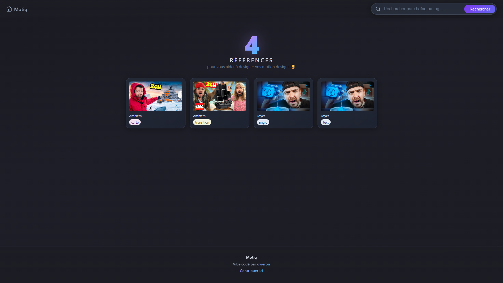

# Motiq

**Motiq** est une bibliothèque de références motion design : des extraits vidéo YouTube avec timecode, classés par auteur et par thème, pour s’inspirer ou retrouver une idée rapidement.

🔗 **Site : [motiq.onrender.com](https://motiq.onrender.com/)**

---

## Concept

Motiq centralise des **références motion design** issues de vidéos YouTube. Chaque référence contient :

- **Une vidéo** (lien YouTube)
- **Un timecode** (moment précis dans la vidéo)
- **Un auteur** (créateur de la vidéo)
- **Des tags** (text, jingle, transition, carte, etc.)

L’objectif : avoir un catalogue consultable et recherchable pour retrouver des idées (typos, transitions, cartes, jingles…) sans regarder des heures de contenu.

### Aperçu



---

## Ajouter une nouvelle référence (via GitHub Issues)

Les nouvelles références sont proposées et ajoutées via **les Issues GitHub**. Ainsi, tout le monde peut suggérer une entrée sans toucher au code.

### Étapes

1. **Ouvrir une Issue** sur le dépôt :  
   [github.com/Theo-Farnole/motiondesign-lib/issues](https://github.com/Theo-Farnole/motiondesign-lib/issues)

2. **Choisir ou créer un template** « Nouvelle référence » (si disponible), sinon décrire la référence avec les infos ci‑dessous.

3. **Renseigner** :
   - **URL de la vidéo YouTube** (ex. `https://www.youtube.com/watch?v=XXXX`)
   - **Timecode** (ex. `10:55` ou « 10 min 55 s »)
   - **Auteur / chaîne**
   - **Tags** (ex. `text`, `transition`, `carte`, `jingle`...)

4. **Soumettre l’Issue**. Un mainteneur ajoutera la référence dans `src/data/references.tsx` (format : `videoId`, `timecode`, `author`, `tags`).

### Exemple d’Issue

```text
Titre : [Nouvelle ref] Transition à 7:10 — Amixem

- Vidéo : https://www.youtube.com/watch?v=cTsONdoPgiU
- Timecode : 7 min 10 s
- Auteur : Amixem
- Tags : transition
```

---

## Lancer le projet en local

```bash
npm install
npm run dev
```

Puis ouvrir [http://localhost:5173](http://localhost:5173).

- **Build :** `npm run build`
- **Preview :** `npm run preview`
- **Générer les screenshots (miniatures réelles) :** `npm run generate:screenshots`
  - **Limite** (ex. 10 refs) : `npm run generate:screenshots -- --limit=10`
  - **Forcer la régénération** : `npm run generate:screenshots -- --force`
- **Nettoyer les screenshots inutilisés :** `npm run clean:screenshots`
  - **Supprimer réellement** : `npm run clean:screenshots -- --delete`

---

## Lien

**Motiq : [motiq.onrender.com](https://motiq.onrender.com/)**
